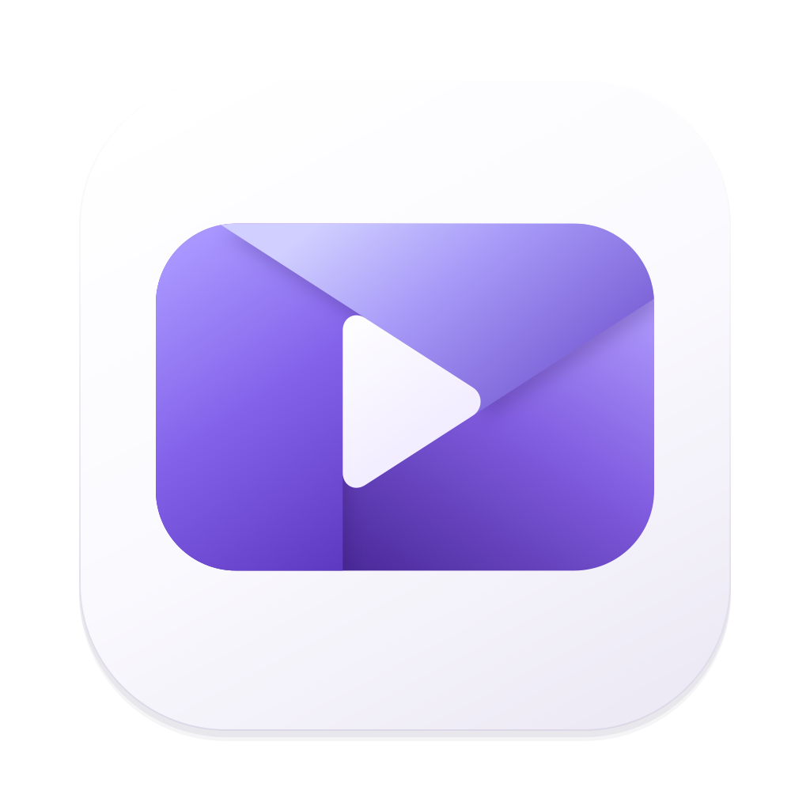
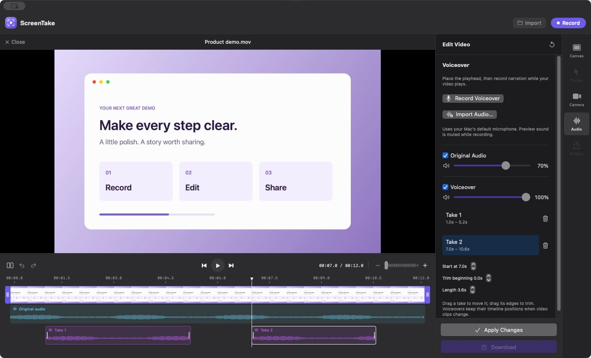
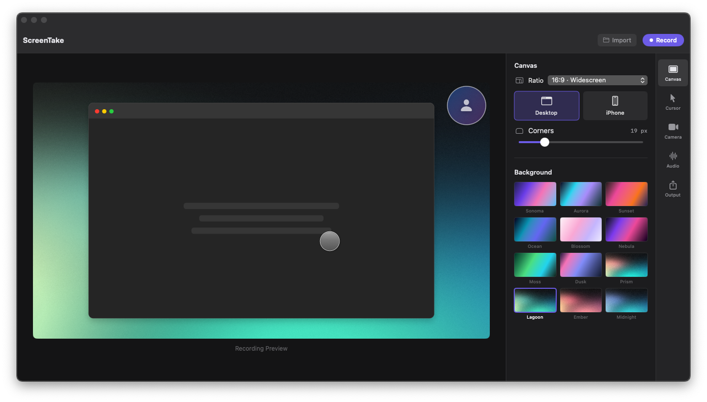

# ScreenTake

ScreenTake is a native screen recorder and editor for Mac. Record your screen, then shape the video with cursor effects, smart zoom, backgrounds, a webcam overlay, and voiceover narration.

**Latest release: 0.1.14 (build 16)** · Apple Silicon (M1 or newer) · macOS 13 Ventura or later

[Visit the website](https://sso-ss.github.io/ScreenTake/) · [Download the DMG](https://sso-ss.github.io/ScreenTake/downloads/ScreenTake-0.1.14-build16.dmg) · [Release notes](https://sso-ss.github.io/ScreenTake/release-notes.html)

## New in 0.1.14

- Open the editor sooner after stopping a recording. Video effects render when you apply changes or download your finished video.
- Retain native screen detail, including odd-sized window captures, and avoid scaling original-size content at 1×.
- Keep the timeline ruler and playhead synchronized with playback, seeking, and timestamps.
- Save editable projects, work with separate recorded audio clips, and use browser-content cropping.
- Choose an app language independently of recording settings.
- Connect AI clients to the local editor to inspect, edit, save, and export an open project.
- Use optional camera beauty and makeup filters with face tracking and faster live previews.
- Find ScreenTake in the menu bar and see an update badge until the available update is installed.
- Keep the three-panel purple logo and the camera, audio, and framing controls from earlier releases.

## Camera and audio improvements from 0.1.12

- Switch camera sections between **Overlay** and **Full Screen**, adjust full-screen zoom and framing, and optionally follow one face.
- Use the main **Split** button to give camera sections their own layout. Splitting a screen recording also splits its camera presentation.
- Add optional smooth camera transitions with adjustable duration and motion.
- Preview your camera directly in the recording canvas. Enabling the camera turns on the microphone; you can still turn it off or use the microphone on its own.
- Choose a microphone above **Record Voiceover**, using the same saved device selection as the recording controls.
- Preserve source resolution through screen exports and use higher-quality camera capture for full-screen layouts.

## See the app

### Edit and add your voice

The native editor in 0.1.10, shown with sample footage and narration. Record a voiceover while the video plays, then move or trim each take on its own audio strip.

### Set up a recording

Choose your canvas, background, cursor, camera, and audio settings before recording. The workspace above shows the recording preview with placeholder content.

## What you can do

| Area | Features in the Mac app |
| --- | --- |
| Screen capture | Choose a display or window; record at 30 or 60 FPS; pause, resume, and stop from the native capture toolbar or keyboard shortcuts. |
| Recording audio | Capture microphone audio, system audio, or both. Choose an available microphone. Camera and microphone controls remain independent; enabling the camera turns the microphone on by default. |
| Voiceover | Choose a microphone and record narration while watching your video, starting at the playhead, or import an audio file. Move, trim, and remove individual takes. View original audio and narration waveforms. Adjust volume and mute separately for original audio and the voiceover group. |
| Timeline editing | Import a video or edit a new recording. Trim, split, remove sections, and drag clips to reorder them. Undo and redo timeline edits; zoom the timeline and scrub the preview. |
| Pause cleanup | Detect pauses, preview the suggestions, and choose which to remove. Undo restores removed sections. |
| Cursor and clicks | Show or hide the recorded cursor; choose Arrow, Hand, or Circle; adjust its size from 50–300%; enable click highlighting and choose its color. |
| Zoom | Use automatic click zoom or toggle manual zoom during recording. Add, move, trim, and remove zoom sections in the editor; adjust zoom strength and focus for eligible recordings. |
| Camera and overlays | Preview your camera in the recording canvas; record or import camera footage. Choose Overlay or Full Screen per section, adjust shape, size, position, zoom, and framing, optionally follow one face, and add smooth transitions with adjustable duration and motion. |
| Canvas and framing | Choose Original, 16:9, 16:10, 1:1, 4:5, or 9:16. Use desktop or phone framing, adjust desktop corners, and crop phone content with Fit or Fill. |
| Backgrounds | Choose built-in wallpapers, including Prism, Lagoon, Ember, and Midnight. Toggle the background for an original-size desktop canvas. |
| Preview and export | Preview edits immediately after recording; render effects when applying changes or exporting a MOV. Save a .screentake project to retain source media and edits. Recordings and editable source files stay on your Mac. |

Select your microphone above **Record Voiceover** in the Audio panel. The selection is shared with the recording controls. **Default** follows your Mac’s default input. Preview sound is muted while recording. Takes keep their timeline positions when video clips change, so check narration alignment after rearranging your video.

## Install

1. Download the DMG on an Apple Silicon Mac.
2. If updating, save your work and quit ScreenTake first.
3. Open the DMG and drag **ScreenTake.app** into **Applications**.
4. Open ScreenTake and allow Screen Recording, Microphone, and Camera access when needed.
5. Make a short test recording and check the exported video and audio before sharing.

Use **File → Save Project…** to retain source media, capture data, and edits in a `.screentake` project. Use the download control to export a finished MOV.

This build is signed with a Developer ID certificate and notarized by Apple. If macOS blocks the first launch, confirm you downloaded the current DMG and report the exact message. Do not disable macOS security protections.

## Keyboard shortcuts

| Shortcut | Action |
| --- | --- |
| Control + Z | Toggle manual zoom during recording. |
| Control + Space | Pause or resume recording. |
| Escape | Stop recording. |
| Command + S | Open the Save dialog when the recording preview is ready. |

The recording shortcuts work across apps. Plain Z and Space also toggle zoom and pause when ScreenTake has keyboard focus. Control + Space can conflict with macOS input-language switching; use the capture toolbar if needed.

## Current limitations and updates

- Smart zoom and recording reliability are still being refined. Some devices may experience microphone stalls or a brief black frame at the start of the webcam overlay. Check the exported result.
- Saved `.screentake` projects retain source media and capture data for later editing. Imported finished videos do not include the original cursor and zoom capture data.
- Editable source media uses local disk space. Save a `.screentake` project to continue editing later; a finished MOV does not preserve the complete editable project.
- ScreenTake checks this repository for new releases about once a day while the app is open and ready to use. You can also choose **ScreenTake → Check for Updates…**. The reminder opens the release page; installation is manual. Version 0.1.10 can update to 0.1.11 through the previous repository, then use the current ScreenTake release page for later updates.

## Feedback

[Report an issue](https://github.com/sso-ss/ScreenTake/issues) with your Mac model, macOS version, ScreenTake version, and steps to reproduce the problem. Remove private information from screenshots and recordings before sharing them.

This repository contains the native app sources, editable promo projects, public website, and release installers. The screenshots show the native Mac app; website animations are demonstrations.

## Build from source

On macOS with Xcode and the required Developer ID signing identity available, run `./Launch ScreenTake.command` from the repository root. The script builds and opens the current app with signing enabled. See [AGENTS.md](AGENTS.md) for signing requirements and [docs](docs) for implementation and validation notes.
